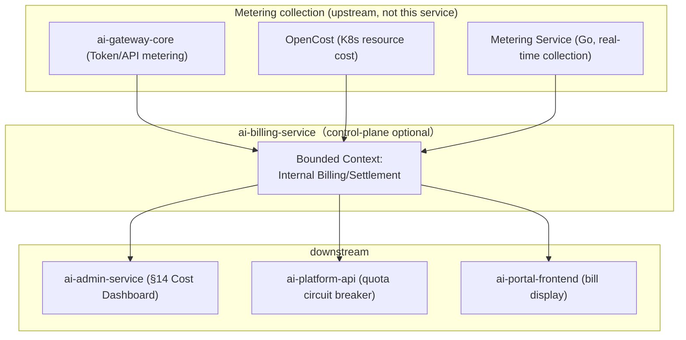
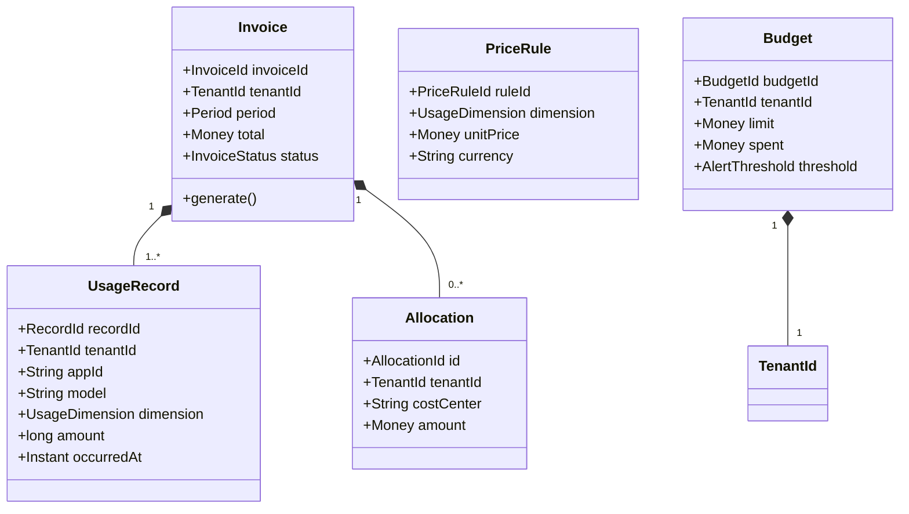
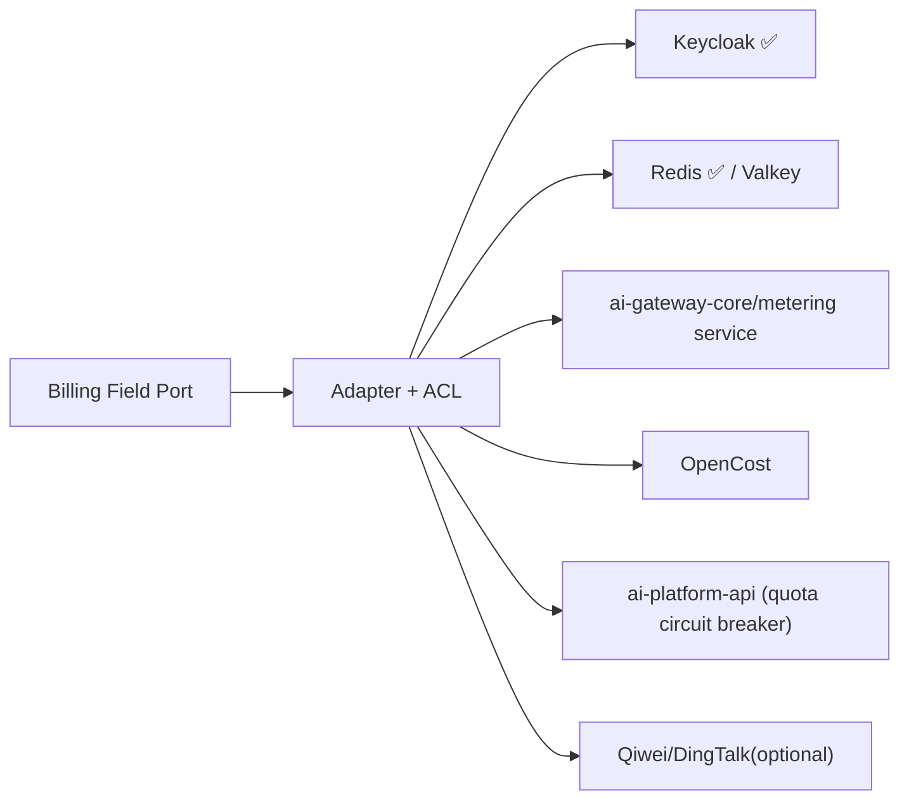
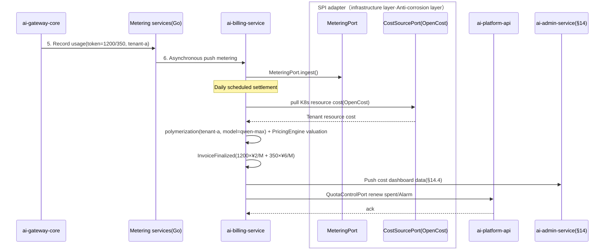
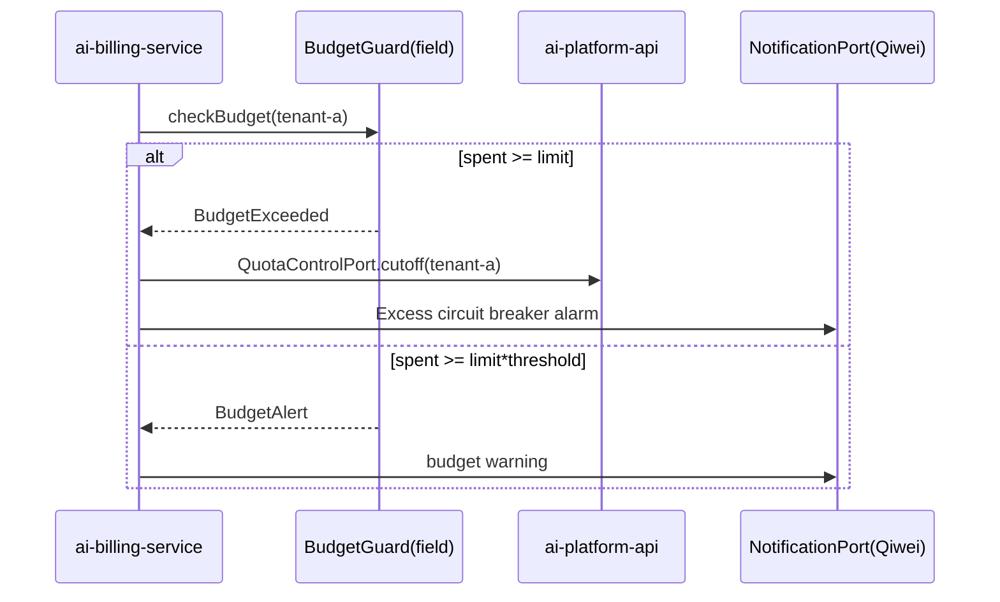

# ai-billing-service · Detailed design document

> **Meta Information**
> | item | value |
> | --- | --- | --- |
> | repo | `ai-billing-service` |
> | Language · Framework | Java · Spring Boot 3.x (Jakarta Persistence, §15.5.1) |
> | Domain | control-plane |
> | optional | yes (optional, **only multi-tenant enabled**: advanced/full profile, see `repos.yaml` / `profiles/advanced.yaml`) |
> | Platform version | v1.0.0 |
> | Document Status | Draft |
> | Responsible person | OpenStrata Architecture Group |
> | Related links | [arch](./arch/ARCH.md) · [skills](./skills/SKILLS.md) · [specs](./specs/SPECS.md) · Architecture document [§8](../../OpenStrata architecture design document v2.8.md) [§4.7.2](../../OpenStrata architecture design document v2.8.md) [§10.4](../../OpenStrata Architecture Design Document v2.8.md) [§15.5](../../OpenStrata Architecture Design Document v2.8.md) [§16](../../OpenStrata Architecture Design Document v2.8.md) |

> This document covers the existing placeholder skeleton and does not change `arch/`, `skills/`, `specs/`, `README.md`. Chapters are strictly organized into 16 sections, and figures are always represented by live ```mermaid```.

---

## 1. Domain context and boundary (Bounded Context)

`ai-billing-service` is OpenStrata's **internal billing/settlement service** (architecture document §8.3, §4.7.2), which only takes effect in the **multi-tenant** form. It aggregates underlying metering (metering, collected by ai-gateway-core, etc., §4.7.2) by tenant and converts it into bills (Showback/Chargeback/cost center), and performs budget alarms and excess circuit breakers. **Only enabled when `multitenancy.enabled=true`** (§12.4: `billing` depends on `multitenancy`).



- **Boundary (upstream)**: Consume metering events/aggregation results (not self-harvested); authenticated by `Auth` SPI (Keycloak).
- **Boundary (Downstream)**: Only bills/alarms are generated, Tokens are not collected, reasoning is not performed, and fees are not deducted (internal transfer price, not external collection).
- **Optional**: optional, **multi-tenant only**; starter/standard does not deploy (§12.2/`profiles/*.yaml` `optional_disabled`). Port 8084 (§15.2).
- **Dependencies**: `billing` → `multitenancy` (§12.4); `multitenancy` → `auth` (§12.4).

---

## 2. List of responsibilities and abilities (mapping §4 responsibilities at each level)

Align §4.7.2 (Internal Billing and Settlement) with §8.3:

| Capabilities | Description | Mapping § |
| --- | --- | --- |
| Measurement aggregation | Aggregate Token, GPU duration, number of vectors, API calls, and Agent execution times by tenant/application/model (§4.7.2) | §4.7.2 |
| Pricing engine | Internal transfer prices (e.g. Token ¥2 input/¥6 output, §4.7.2) | §4.7.2 / §8.3 |
| Bill generation | Tenant bill (monthly/daily), department allocation Showback, cost center Chargeback (§4.7.2) | §4.7.2 / §8.3 |
| Budget alarm | Excess circuit breaker + alarm (§4.7.2) | §4.7.2 |
| Cost dashboard data | Cost visualization data provided to admin-service / portal | §14.4 / §14.5 |
| Quota linkage | Notify ai-platform-api to trigger a circuit breaker when the quota is exceeded (§8.2 Quota) | §8.2 / §14.5 |

---

## 3. Domain model (Aggregate / Entity / Value Object / Domain events)



**Aggregate (aggregate root)**: `Invoice` (including `UsageRecord` + `Allocation`), `Budget`.

**Entity**: `UsageRecord`, `PriceRule`, `Allocation`.

**Value Object (value object)**: `RecordId`/`InvoiceId`/`PriceRuleId`/`BudgetId`/`AllocationId`, `TenantId`, `UsageDimension` (TOKEN_INPUT/TOKEN_OUTPUT/GPU_HOUR /VECTOR_COUNT/API_CALL/AGENT_RUN), `Money` (amount+currency), `Period` (monthly/daily), `InvoiceStatus` (DRAFT/FINALIZED/SENT), `AlertThreshold`.

**Domain Events**
- `UsageAggregated` → Enter the aggregation pipeline.
- `InvoiceFinalized` → Push admin-service cost dashboard and portal bill.
- `BudgetExceeded` → Notify ai-platform-api to trigger quota circuit breaker (§8.2).
- `BudgetAlert` → Alerting (Qiwei/DingTalk, §4.8 Alerting).

---

## 4. Application layer use cases (Application Service & Use Case list)

| Use Case | Application Service | Transactions | Domain Events |
| --- | --- | --- | --- |
| Receive Metering | `MeteringIngestAppService.ingest()` | Write (batch/stream) | `UsageAggregated` |
| Daily aggregation | `AggregationAppService.aggregateDaily()` | Write (scheduling) | `UsageAggregated` |
| Calculate cost | `PricingAppService.price()` | Read | — |
| Generate bill | `InvoiceAppService.finalize()` | Write | `InvoiceFinalized` |
| Department allocation | `AllocationAppService.allocate()` | Write | — (Write to Invoice) |
| Set budget | `BudgetAppService.setBudget()` | Write | — |
| Budget check | `BudgetAppService.check()` | Read | `BudgetAlert` / `BudgetExceeded` |
| Query cost portrait | `CostQueryService.getTenantCost()` | Read | — |

> Aggregation/exit timing scheduling (Spring `@Scheduled` / external CronJob); metering incoming messages/REST batches.

---

## 5. Domain services and core business rules

- **`PricingEngine`**: Calculate internal transfer price by `UsageDimension` × `PriceRule` (§4.7.2 example: Token ¥2 input/¥6 output, GPU ¥15/h A100, vector ¥0.5/1M, document ¥0.1/GB, API ¥0.5/10,000 times). Price lists are configurable and versioned.
- **`AggregationRule`**: Aggregation by `tenant × app × model × dimension`; metering is always on for core (§12.1 `metering.enabled=true`), but **settlement is only multi-tenant** enabled.
- **`BudgetGuard`**: `spent >= limit × threshold` triggers `BudgetAlert`; `spent >= limit` triggers `BudgetExceeded` → quota circuit breaker (§8.2 / §14.5 "Excess circuit breaker + alarm").
- **`ChargebackRule`**: Apportion the tenant general ledger according to `costCenter`/`department` (Showback/Chargeback, §4.7.2).
- **`BillingMultitenancyRule`**: Force `tenant_id` isolation; this service is not deployed in single-tenant form (starter/standard) (§12.4 Dependency Verification).

---

## 6. SPI port and adapter (Port definition + Adapter + ACL anti-corrosion layer, mapping §10.4)

| Port (domain layer definition) | SPI port (bom.yaml) | Adapter implementation (default ✅ / alternative) | ACL responsibility |
| --- | --- | --- | --- |
| `AuthPort` | `Auth`（§4.7.3） | **Keycloak@25.0.0 ✅** | token/claims → `TenantContext` |
| `CachePort` | `Cache` (§4.3.4) | **Redis@7.4.0 ✅** / Valkey@7.2.0 optional | Aggregation intermediate result cache (tenant prefix) |
| `MeteringPort` | — (§4.7.2) | Consuming ai-gateway-core/Metering Service (Go) Events | External Metering Record ⇄ Internal `UsageRecord` |
| `CostSourcePort` | — (§4.7.2) | OpenCost Adapter (K8s Resource Cost) | External Cost ⇄ Internal `Money` |
| `QuotaControlPort` | — (§8.2) | REST call `ai-platform-api` | Billing ⇄ Quota Breaking DTO (anti-corrosion) |
| `NotificationPort` | — (§4.8 Alerting) | Qiwei/DingTalk Adapter (optional) | Alarm events ⇄ External messages |



> **Multiple implementations coexist**: Redis (core)/Valkey (optional OSI replacement, §16.3) under `CachePort` can coexist through the same Port, and there is no change when switching (§10.4). `MeteringPort`/`CostSourcePort` supports the coexistence of multiple metering sources (gateway metering + OpenCost), aggregated by `tenant_id`.

---

## 7. External API contract (REST/gRPC critical path, status code, error code, OpenAPI key points)

REST (Spring MVC + SpringDoc), prefix `/api/v1`; internally provides gRPC `BillingQuery` for admin-service (see `specs/` for proto).

**Critical Path**

```text
POST   /api/v1/usage                                #Intake metering (batch)
GET    /api/v1/tenants/{tenantId}/invoices          #Bill list
GET    /api/v1/tenants/{tenantId}/invoices/{id}     #Bill details
GET    /api/v1/tenants/{tenantId}/cost              #Cost profiling (real-time)
PUT    /api/v1/tenants/{tenantId}/budgets           #Set a budget
GET    /api/v1/tenants/{tenantId}/budgets           #budget status
GET    /api/v1/tenants/{tenantId}/allocations       #Department allocation (Showback)
POST   /api/v1/reports:generate                     #Trigger monthly payment
GET    /api/v1/price-rules                          #Current pricing table
```

**Status code**: 2xx; `400` Illegal metering format; `401/403` Authentication/override (not the tenant); `404` Bill/tenant does not exist; `409` Duplicate billing; `422` Calling billing under a single tenant (should return `BILLING_REQUIRES_MULTITENANCY`); `500` Internal.

**Error code**

```json
{
  "code": "BILLING_REQUIRES_MULTITENANCY",
  "message": "The billing service is only enabled in multi-tenancy (advanced/full), please turn on multitenancy first",
  "traceId": "fa11ed",
  "doc": "https://docs.openstrata.io/errors/BILLING_REQUIRES_MULTITENANCY"
}
```

**OpenAPI Points**: `openapi.yaml` is generated by SpringDoc; the amount is unified `Money{amount,currency}`; `usage.dimension` enumeration alignment §4.7.2.

---

## 8. Data model and persistence (table structure / JPA / migration script)

Base: PostgreSQL@16.0 (core, §16 base). Multi-tenancy by `tenant_id` column isolation + RLS (§8.2).

```sql
-- Billing library（shared schema: billing）
CREATE TABLE usage_records (
  record_id    VARCHAR(64) PRIMARY KEY,
  tenant_id    VARCHAR(64) NOT NULL,
  app_id       VARCHAR(64),
  model        VARCHAR(64),
  dimension    VARCHAR(24) NOT NULL,     -- TOKEN_INPUT/TOKEN_OUTPUT/GPU_HOUR/VECTOR_COUNT/API_CALL/AGENT_RUN
  amount       BIGINT      NOT NULL,
  occurred_at  TIMESTAMPTZ NOT NULL
);
CREATE INDEX idx_usage_tenant_day ON usage_records(tenant_id, occurred_at);

CREATE TABLE price_rules (
  rule_id    VARCHAR(64) PRIMARY KEY,
  dimension  VARCHAR(24) NOT NULL,
  unit_price BIGINT      NOT NULL,        -- Store in smallest monetary unit(point)
  currency   VARCHAR(8)  NOT NULL DEFAULT 'CNY',
  effective  TIMESTAMPTZ NOT NULL
);

CREATE TABLE invoices (
  invoice_id  VARCHAR(64) PRIMARY KEY,
  tenant_id   VARCHAR(64) NOT NULL,
  period      VARCHAR(16) NOT NULL,       -- 2026-07(monthly) / 2026-07-17(daily)
  total       BIGINT      NOT NULL,
  currency    VARCHAR(8)  NOT NULL,
  status      VARCHAR(16) NOT NULL DEFAULT 'DRAFT',
  finalized_at TIMESTAMPTZ
);

CREATE TABLE invoice_lines (
  line_id     VARCHAR(64) PRIMARY KEY,
  invoice_id  VARCHAR(64) NOT NULL REFERENCES invoices(invoice_id),
  dimension   VARCHAR(24) NOT NULL,
  quantity    BIGINT NOT NULL,
  unit_price  BIGINT NOT NULL,
  subtotal    BIGINT NOT NULL
);

CREATE TABLE allocations (
  alloc_id     VARCHAR(64) PRIMARY KEY,
  invoice_id   VARCHAR(64) NOT NULL REFERENCES invoices(invoice_id),
  cost_center  VARCHAR(64) NOT NULL,
  amount       BIGINT NOT NULL
);

CREATE TABLE budgets (
  budget_id   VARCHAR(64) PRIMARY KEY,
  tenant_id   VARCHAR(64) NOT NULL UNIQUE,
  limit_val   BIGINT NOT NULL,
  spent       BIGINT NOT NULL DEFAULT 0,
  threshold   NUMERIC(5,2) NOT NULL DEFAULT 0.8
);
```

**JPA**: `UsageRecordEntity`/`InvoiceEntity`/`PriceRuleEntity`/`BudgetEntity`; JSONB is not used, the amount is stored in the smallest unit (cents) to avoid floating points; migrate **Flyway** (`V1__billing_init.sql` / `V2__rls.sql`).

---

## 9. Key business processes and sequence diagrams (Mermaid sequence, including cross-service SPI calls)

**Process: Daily measurement → Aggregation → Accounting → Cost dashboard (§8.3)**



**Process: Budget Excess → Quota Circuit Breaker (§8.2 / §14.5)**



---

## 10. Configuration and Profile (align meta profiles: starter~full + optional capability switch)

This service switch aligns `profiles/*.yaml` with `PlatformManifest.spec.billing` (§12.1):

```yaml
openstrata:
  service:
    port: 8084
  features:
    billing:
      enabled: false              #Off by default; only enabled by the assembly engine when multitenancy is on
    budgetAlert:
      enabled: true
      threshold: 0.8
    showback:
      enabled: true               #Department allocation
  pricing:                        #Internal transfer prices (§4.7.2 example)
    token_input:  2               # ¥/1M
    token_output: 6
    gpu_hour:     15              # A100 80G
    vector_1m:    0.5
    doc_gb:       0.1
    api_10k:      0.5
  spi:
    auth:   { provider: keycloak }
    cache:  { provider: redis }   #valkey alternative (§16.3)
    metering:
      source: [ai-gateway-core, opencost]
```

| Profile | billing | Description |
| --- | --- | --- |
| starter | false | `optional_disabled` with ai-billing-service (§12.2) |
| standard | false | Still single tenant, no deployment |
| advanced | **true** | Multi-tenant internal settlement (§11.2 Phase 3, §4.8 S1) |
| full | **true** | Full multi-tenant + billing |

> `billing` strongly depends on `multitenancy` (§12.4). The assembly engine will perform dependency verification before lighting up. If it is missing, `BILLING_REQUIRES_MULTITENANCY` will be used.

---

## 11. Integration point (other dependent services/SPI/external OSS, reference bom.yaml)

| Integration Point | Type | Instance (bom.yaml) | Description |
| --- | --- | --- | --- |
| Keycloak | External OSS (Auth SPI) | keycloak@25.0.0 ✅ core | Authentication (§4.7.3) |
| Redis / Valkey | External OSS (Cache SPI) | redis@7.4.0 ✅ / valkey@7.2.0 optional | Cache (§16.3) |
| PostgreSQL | base base | postgresql@16.0 ✅ core | persistence |
| OpenCost | External OSS (cost collection) | Reference §4.7.2 Cost collection | K8s resource cost |
| ai-gateway-core | Internal services | Go v1.0.0 | Token/API metering (§4.7.2) |
| Metering Service (Go) | Internal Services | Go v1.0.0 | Real-time Collection (§4.7.2) |
| ai-platform-api | Internal services | Java v1.0.0 | Quota circuit breaker linkage (§8.2) |
| ai-admin-service | Internal service | Java v1.0.0 | Cost dashboard (§14.4/§14.5) |
| Capsule | External OSS (MultiTenancy SPI) | capsule@1.9.0 optional | Multi-tenant prerequisite (§8.2) |

---

## 12. Security and multi-tenancy (authentication/permissions/data isolation/auditing, mapping §8·§14)

- **Authentication**: Via `AuthPort` (Keycloak), `X-Tenant-Id` is injected by the gateway; bill query is strictly within the tenant scope, and cross-tenant query requires platform-admin (§14.3).
- **Permissions**: platform-admin can see the costs of the entire platform; tenant-admin can see the bills of this tenant; developer/viewer is restricted (§14.3 Role Model).
- **Data isolation**: `tenant_id` column + RLS (§8.2 matrix); this service is only deployed in multi-tenants and has no single-tenant data.
- **Audit**: Accounting/budget changes/circuit breaker action traces (§14.6 / §4.7.4); metered intake log desensitization (original Prompt text is not saved).

---

## 13. Observability (log/tracking/metrics/audit points)

- **Basic Tracing + Audit (core, §4.8)**: OTel traces + audit are enabled by default.
- **Metrics (recommended)**: `billing_records_ingested`, `invoice_finalized_total`, `budget_utilization{tenant}`, `cost_per_tenant{model}`, `billing_latency`.
- **Logging**: Structured JSON + MDC `tenant_id`; Loki optional.
- **Alerting**: `BudgetAlert`/`BudgetExceeded` via AlertManager + Qiwei/DingTalk (§4.8).

---

## 14. Deployment and elasticity (K8s resources/HPA/probes)

- **Deployment**: `ai-billing-service`, stateless (aggregated calculations), 2 replicas; deployed in advanced/full only; mirrors `openstrata/ai-billing-service:v1.0.0`.
- **Namespace**: Shared `ai-system` (§9.2); dependency `ai-tenant-*` already exists.
- **Probe**:
  - liveness：`GET /actuator/health/liveness`
- readiness: `GET /actuator/health/readiness` (depends on PG/Redis/metering source)
- **HPA**: Based on `cpu` + `billing_qps`, min 2 / max 6.
- **Resources**: request 500m / 1Gi, limit 1 CPU / 2Gi; the withdrawal window can be allocated in a short time.
- **Configuration**: ConfigMap + Secret, Helm values ​​rendered by `ai-provisioning-engine` (§13.3); subject to `billing`→`multitenancy` dependency (§12.4).

---

## 15. Test strategy (single test/integration/contract test)

- **Single test (domain layer)**: `PricingEngine` (pricing in each dimension), `BudgetGuard` (threshold/circuit breaker), `ChargebackRule` (apportionment) pure logic single test, coverage ≥ 85%.
- **Integration**: Testcontainers (PostgreSQL + Redis) validate JPA/JSONB/RLS/Flyway with daily aggregation scheduling.
- **SPI Contract**: `AuthPort`/`CachePort` versus `bom.yaml` `interface_versions` (`bump-spi-version` of `skills/`); `MeteringPort`/`CostSourcePort` versus metering source contract.
- **Cross-service contract**: `QuotaControlPort` circuit breaker contract with `ai-platform-api`; cost dashboard data contract with `ai-admin-service`.
- **E2E**: `demo/advanced` runs the full link of "multi-tenant usage → daily billing → budget excess circuit breaker".

---

## 16. Open issues and pending items

1. **Settlement Currency and Precision**: Does the internal transfer price support multiple currencies? Currently, CNY is deposited in cents (the smallest unit). Cross-border/multi-currency needs to be expanded to `Money`.
2. **Metering and billing are ultimately consistent**: Metering is pushed asynchronously, and there may be a delay between the `spent` and the real-time quota at the time of bill generation, and an SLA needs to be defined (recommended ≤ 5min).
3. **GPU billing timing**: GPU billing actually occurs with self-hosted inference (full file) (§8.1 D5 / §14.4). The advanced file GPU quota does not actually take effect. It needs to be clarified whether billing will be included.
4. **OpenCost access method**: Whether to check the Prometheus/OpenCost API directly or consume its exports, it needs to be aligned with the `ai-observability` namespace (§9.2).
5. **Circuit breaker and quota linkage**: The circuit breaker granularity of `BudgetExceeded → Quota circuit breaker` (tenant level QPS or application level) is to be determined. It is recommended that tenant level + application level be optional.

---

> **Change Record**
> | Version | Date | Description |
> | --- | --- | --- |
> | v1.0-Draft | 2026-07-17 | Initial detailed design, covering the placeholder skeleton, 16 sections complete |

> **Traceability Matrix (this document section ↔ Architectural Design Document § number) **
> | Chapters | Architecture Documentation § |
> | --- | --- |
> | 1 Domain context | §8.3 / §4.7.2 / §12.4 |
> | 2 Responsibilities List | §4.7.2 / §8.3 |
> | 3 Domain Model | §15.5.2 / §8.3 |
> | 4 Application layer use cases | §15.5.2 ② |
> | 5 Domain Service Rules | §4.7.2 / §8.2 / §14.5 |
> | 6 SPI Ports and Adapters | §10.3 / §10.4 / §15.5.4 |
> | 7 External API Contract | §8.3 / §16.4 |
> | 8 Data Model | §8.2 / §16 base |
> | 9 Business process timing | §8.3 / §15.5.2.2 |
> | 10 Configuration and Profile | §12.1 / §12.2 / §12.4 |
> | 11 integration points | §4.7.2 / §15.2 / bom.yaml |
> | 12 Security and Multi-Tenancy | §8 / §14.3 / §4.7.4 |
> | 13 Observability | §4.8 |
> | 14 Deployment and Resilience | §9.2 |
> | 15 Testing Strategies | §15.5.5 |
> | 16 Open Questions | — |
