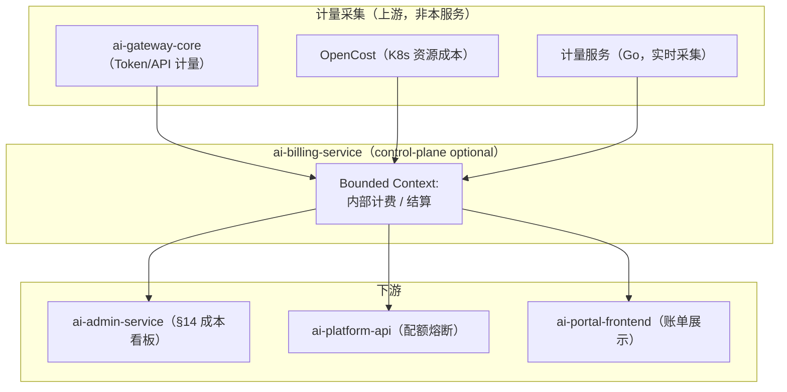
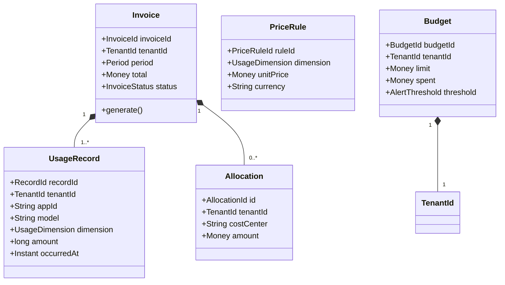
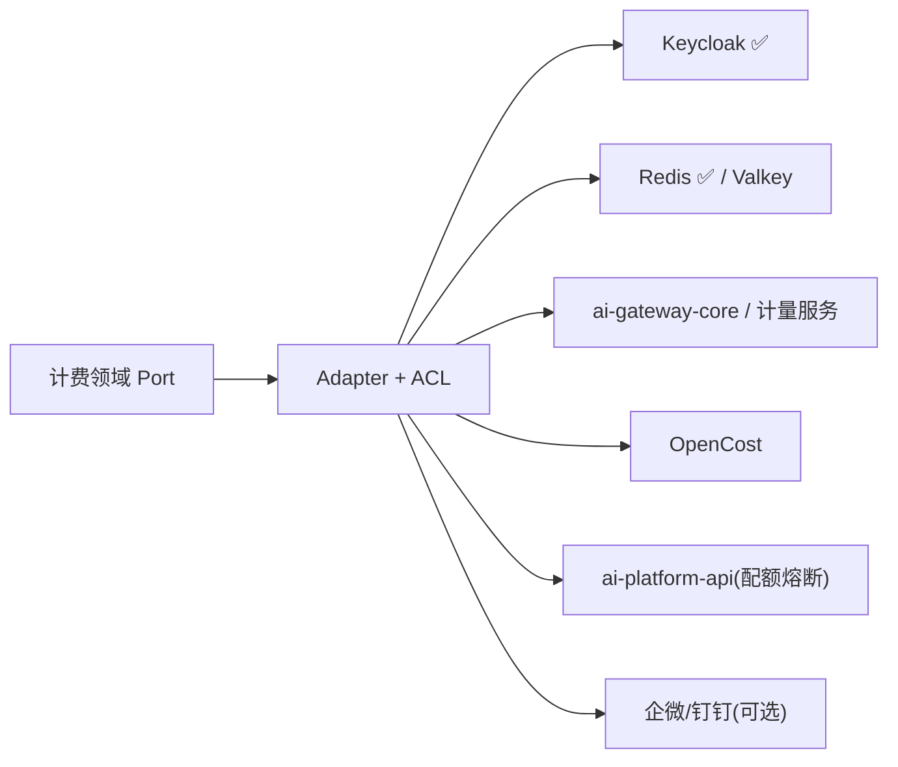
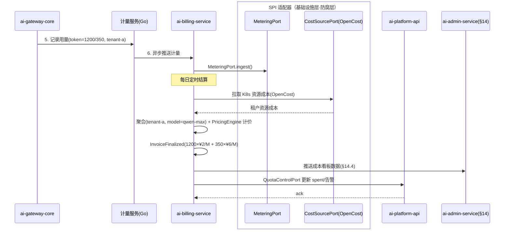
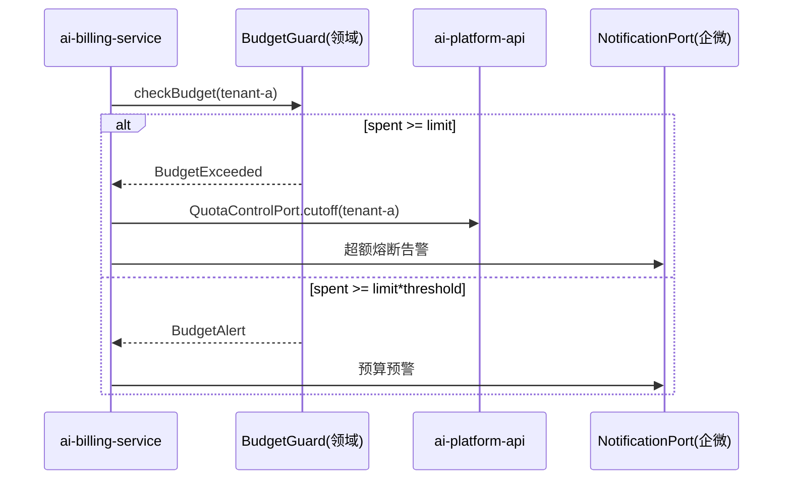

# ai-billing-service · 详细设计文档

> **元信息**
> | 项 | 值 |
> | --- | --- | --- |
> | repo | `ai-billing-service` |
> | 语言·框架 | Java · Spring Boot 3.x（Jakarta Persistence，§15.6.1） |
> | 领域 | control-plane |
> | optional | 是（optional，**仅多租户启用**：advanced/full 档，见 `repos.yaml` / `profiles/advanced.yaml`） |
> | 平台版本 | v1.4.0 |
> | 文档状态 | 草稿 |
> | 负责人 | OpenStrata 架构组 |
> | 关联链接 | [arch](./arch/ARCH.md) · [skills](./skills/SKILLS.md) · [specs](./specs/SPECS.md) · 架构文档 [§8](../../OpenStrata架构设计文档 v2.8.md) [§4.7.2](../../OpenStrata架构设计文档 v2.8.md) [§10.4](../../OpenStrata架构设计文档 v2.8.md) [§15.6](../../OpenStrata架构设计文档 v2.8.md) [§16](../../OpenStrata架构设计文档 v2.8.md) |

> 本文档覆盖现有占位骨架，不改动 `arch/`、`skills/`、`specs/`、`README.md`。章节严格按 16 节组织，图一律用 live ```mermaid```。

---

## 1. 领域上下文与边界（Bounded Context）

`ai-billing-service` 是 OpenStrata 的**内部计费 / 结算服务**（架构文档 §8.3、§4.7.2），只对**多租户**形态生效。它把底层计量（metering，由 ai-gateway-core 等采集，§4.7.2）按租户聚合并转换为账单（Showback / Chargeback / 成本中心），并执行预算告警与超额熔断。**仅在 `multitenancy.enabled=true` 时启用**（§12.4：`billing` 依赖 `multitenancy`）。



- **边界（上游）**：消费计量事件/聚合结果（非自采）；经 `Auth` SPI 鉴权（Keycloak）。
- **边界（下游）**：只产出账单/告警，不采集 Token、不执行推理、不扣费（内部转移价格，非对外收款）。
- **可选性**：optional，**仅多租户**；starter/standard 不部署（§12.2 / `profiles/*.yaml` `optional_disabled`）。端口 8084（§15.2）。
- **依赖**：`billing` → `multitenancy`（§12.4）；`multitenancy` → `auth`（§12.4）。

---

## 2. 职责与能力清单（映射 §4 各层职责）

对齐 §4.7.2（内部计费与结算）与 §8.3：

| 能力 | 说明 | 映射 § |
| --- | --- | --- |
| 计量聚合 | 按租户/应用/模型聚合 Token、GPU 时长、向量数、API 调用、Agent 执行次数（§4.7.2） | §4.7.2 |
| 定价引擎 | 内部转移价格（如 Token ¥2 输入/¥6 输出，§4.7.2） | §4.7.2 / §8.3 |
| 账单生成 | 租户账单（月度/日度）、部门分摊 Showback、成本中心 Chargeback（§4.7.2） | §4.7.2 / §8.3 |
| 预算告警 | 超额熔断 + 告警（§4.7.2） | §4.7.2 |
| 成本看板数据 | 提供给 admin-service / portal 的成本可视化数据 | §14.4 / §14.5 |
| 配额联动 | 超额时通知 ai-platform-api 触发熔断（§8.2 配额） | §8.2 / §14.5 |

---

## 3. 领域模型（Aggregate / Entity / Value Object / 领域事件）



**Aggregate（聚合根）**：`Invoice`（含 `UsageRecord` + `Allocation`）、`Budget`。

**Entity（实体）**：`UsageRecord`、`PriceRule`、`Allocation`。

**Value Object（值对象）**：`RecordId`/`InvoiceId`/`PriceRuleId`/`BudgetId`/`AllocationId`、`TenantId`、`UsageDimension`（TOKEN_INPUT/TOKEN_OUTPUT/GPU_HOUR/VECTOR_COUNT/API_CALL/AGENT_RUN）、`Money`（amount+currency）、`Period`（monthly/daily）、`InvoiceStatus`（DRAFT/FINALIZED/SENT）、`AlertThreshold`。

**领域事件**
- `UsageAggregated` → 进入聚合流水线。
- `InvoiceFinalized` → 推送 admin-service 成本看板、portal 账单。
- `BudgetExceeded` → 通知 ai-platform-api 触发配额熔断（§8.2）。
- `BudgetAlert` → 告警（企微/钉钉，§4.8 Alerting）。

---

## 4. 应用层用例（Application Service & Use Case 列表）

| Use Case | Application Service | 事务 | 领域事件 |
| --- | --- | --- | --- |
| 接收计量 | `MeteringIngestAppService.ingest()` | 写（批/流） | `UsageAggregated` |
| 日度聚合 | `AggregationAppService.aggregateDaily()` | 写（调度） | `UsageAggregated` |
| 计算费用 | `PricingAppService.price()` | 读 | — |
| 生成账单 | `InvoiceAppService.finalize()` | 写 | `InvoiceFinalized` |
| 部门分摊 | `AllocationAppService.allocate()` | 写 | —（写入 Invoice） |
| 设定预算 | `BudgetAppService.setBudget()` | 写 | — |
| 预算检查 | `BudgetAppService.check()` | 读 | `BudgetAlert` / `BudgetExceeded` |
| 查询成本画像 | `CostQueryService.getTenantCost()` | 读 | — |

> 聚合/出账走定时调度（Spring `@Scheduled` / 外部 CronJob）；计量摄入走消息/REST 批量。

---

## 5. 领域服务与核心业务规则

- **`PricingEngine`**：按 `UsageDimension` × `PriceRule` 计算内部转移价格（§4.7.2 示例：Token ¥2 输入/¥6 输出、GPU ¥15/h A100、向量 ¥0.5/1M、文档 ¥0.1/GB、API ¥0.5/万次）。价格表可配置、版本化。
- **`AggregationRule`**：按 `tenant × app × model × dimension` 聚合；计量为 core 永远开（§12.1 `metering.enabled=true`），但**结算仅多租户**启用。
- **`BudgetGuard`**：`spent >= limit × threshold` 触发 `BudgetAlert`；`spent >= limit` 触发 `BudgetExceeded` → 配额熔断（§8.2 / §14.5 "超额熔断 + 告警"）。
- **`ChargebackRule`**：把租户总账按 `costCenter`/`department` 分摊（Showback/Chargeback，§4.7.2）。
- **`BillingMultitenancyRule`**：强制 `tenant_id` 隔离；单租户形态（starter/standard）本服务不部署（§12.4 依赖校验）。

---

## 6. SPI 端口与适配器（Port 定义 + Adapter + ACL 防腐层，映射 §10.4）

| Port（领域层定义） | SPI 端口（bom.yaml） | Adapter 实现（默认 ✅ / 备选） | ACL 职责 |
| --- | --- | --- | --- |
| `AuthPort` | `Auth`（§4.7.3） | **Keycloak@25.0.0 ✅** | token/claims → `TenantContext` |
| `CachePort` | `Cache`（§4.3.4） | **Redis@7.4.0 ✅** / Valkey@7.2.0 optional | 聚合中间结果缓存（租户前缀） |
| `MeteringPort` | —（§4.7.2） | 消费 ai-gateway-core / 计量服务（Go）事件 | 外部计量记录 ⇄ 内部 `UsageRecord` |
| `CostSourcePort` | —（§4.7.2） | OpenCost Adapter（K8s 资源成本） | 外部成本 ⇄ 内部 `Money` |
| `QuotaControlPort` | —（§8.2） | REST 调用 `ai-platform-api` | 账单 ⇄ 配额熔断 DTO（防腐） |
| `NotificationPort` | —（§4.8 Alerting） | 企微/钉钉 Adapter（可选） | 告警事件 ⇄ 外部消息 |



> **多实现并存**：`CachePort` 下 Redis（core）/ Valkey（optional OSI 替代，§16.3）经同一 Port 并存、切换零改动（§10.4）。`MeteringPort`/`CostSourcePort` 支持多计量源并存（网关计量 + OpenCost），由 `tenant_id` 聚合。

---

## 7. 对外 API 契约（REST/gRPC 关键路径、状态码、错误码、OpenAPI 要点）

REST（Spring MVC + SpringDoc），前缀 `/api/v1`；内部对 admin-service 提供 gRPC `BillingQuery`（proto 见 `specs/`）。

**关键路径**

```text
POST   /api/v1/usage                                # 摄入计量（批量）
GET    /api/v1/tenants/{tenantId}/invoices          # 账单列表
GET    /api/v1/tenants/{tenantId}/invoices/{id}     # 账单明细
GET    /api/v1/tenants/{tenantId}/cost              # 成本画像(实时)
PUT    /api/v1/tenants/{tenantId}/budgets           # 设定预算
GET    /api/v1/tenants/{tenantId}/budgets           # 预算状态
GET    /api/v1/tenants/{tenantId}/allocations       # 部门分摊(Showback)
POST   /api/v1/reports:generate                     # 触发月度出账
GET    /api/v1/price-rules                          # 当前定价表
```

**状态码**：2xx；`400` 计量格式非法；`401/403` 鉴权/越权（非本租户）；`404` 账单/租户不存在；`409` 重复出账；`422` 单租户下调用计费（应返回 `BILLING_REQUIRES_MULTITENANCY`）；`500` 内部。

**错误码**

```json
{
  "code": "BILLING_REQUIRES_MULTITENANCY",
  "message": "计费服务仅在多租户(advanced/full)启用，请先点亮 multitenancy",
  "traceId": "fa11ed",
  "doc": "https://docs.openstrata.io/errors/BILLING_REQUIRES_MULTITENANCY"
}
```

**OpenAPI 要点**：`openapi.yaml` 由 SpringDoc 生成；金额统一 `Money{amount,currency}`；`usage.dimension` 枚举对齐 §4.7.2。

---

## 8. 数据模型与持久化（表结构 / JPA / 迁移脚本）

底座：PostgreSQL@16.0（core，§16 base）。多租户按 `tenant_id` 列隔离 + RLS（§8.2）。

```sql
-- 计费库（shared schema: billing）
CREATE TABLE usage_records (
  record_id    VARCHAR(64) PRIMARY KEY,
  tenant_id    VARCHAR(64) NOT NULL,
  app_id       VARCHAR(64),
  model        VARCHAR(64),
  dimension    VARCHAR(24) NOT NULL,     -- TOKEN_INPUT/TOKEN_OUTPUT/GPU_HOUR/VECTOR_COUNT/API_CALL/AGENT_RUN
  amount       BIGINT      NOT NULL,
  occurred_at  TIMESTAMPTZ NOT NULL
);
CREATE INDEX idx_usage_tenant_day ON usage_records(tenant_id, occurred_at);

CREATE TABLE price_rules (
  rule_id    VARCHAR(64) PRIMARY KEY,
  dimension  VARCHAR(24) NOT NULL,
  unit_price BIGINT      NOT NULL,        -- 以最小货币单位存储(分)
  currency   VARCHAR(8)  NOT NULL DEFAULT 'CNY',
  effective  TIMESTAMPTZ NOT NULL
);

CREATE TABLE invoices (
  invoice_id  VARCHAR(64) PRIMARY KEY,
  tenant_id   VARCHAR(64) NOT NULL,
  period      VARCHAR(16) NOT NULL,       -- 2026-07(monthly) / 2026-07-17(daily)
  total       BIGINT      NOT NULL,
  currency    VARCHAR(8)  NOT NULL,
  status      VARCHAR(16) NOT NULL DEFAULT 'DRAFT',
  finalized_at TIMESTAMPTZ
);

CREATE TABLE invoice_lines (
  line_id     VARCHAR(64) PRIMARY KEY,
  invoice_id  VARCHAR(64) NOT NULL REFERENCES invoices(invoice_id),
  dimension   VARCHAR(24) NOT NULL,
  quantity    BIGINT NOT NULL,
  unit_price  BIGINT NOT NULL,
  subtotal    BIGINT NOT NULL
);

CREATE TABLE allocations (
  alloc_id     VARCHAR(64) PRIMARY KEY,
  invoice_id   VARCHAR(64) NOT NULL REFERENCES invoices(invoice_id),
  cost_center  VARCHAR(64) NOT NULL,
  amount       BIGINT NOT NULL
);

CREATE TABLE budgets (
  budget_id   VARCHAR(64) PRIMARY KEY,
  tenant_id   VARCHAR(64) NOT NULL UNIQUE,
  limit_val   BIGINT NOT NULL,
  spent       BIGINT NOT NULL DEFAULT 0,
  threshold   NUMERIC(5,2) NOT NULL DEFAULT 0.8
);
```

**JPA**：`UsageRecordEntity`/`InvoiceEntity`/`PriceRuleEntity`/`BudgetEntity`；JSONB 不用，金额存最小单位（分）避免浮点；迁移 **Flyway**（`V1__billing_init.sql` / `V2__rls.sql`）。

---

## 9. 关键业务流程与时序图（Mermaid 时序，含跨服务 SPI 调用）

**流程：日度计量 → 聚合 → 出账 → 成本看板（§8.3）**



**流程：预算超额 → 配额熔断（§8.2 / §14.5）**



---

## 10. 配置与 Profile（对齐 meta profiles：starter~full + 可选能力开关）

本服务开关对齐 `profiles/*.yaml` 与 `PlatformManifest.spec.billing`（§12.1）：

```yaml
openstrata:
  service:
    port: 8084
  features:
    billing:
      enabled: false              # 默认关；仅 multitenancy 点亮时由装配引擎开启
    budgetAlert:
      enabled: true
      threshold: 0.8
    showback:
      enabled: true               # 部门分摊
  pricing:                        # 内部转移价格（§4.7.2 示例）
    token_input:  2               # ¥/1M
    token_output: 6
    gpu_hour:     15              # A100 80G
    vector_1m:    0.5
    doc_gb:       0.1
    api_10k:      0.5
  spi:
    auth:   { provider: keycloak }
    cache:  { provider: redis }   # valkey 备选（§16.3）
    metering:
      source: [ai-gateway-core, opencost]
```

| Profile | billing | 说明 |
| --- | --- | --- |
| starter | false | `optional_disabled` 含 ai-billing-service（§12.2） |
| standard | false | 仍单租户，不部署 |
| advanced | **true** | 多租户内部结算（§11.2 阶段三、§4.8 S1） |
| full | **true** | 全量多租户 + 计费 |

> `billing` 强依赖 `multitenancy`（§12.4），装配引擎点亮前会先做依赖校验，缺失则 `BILLING_REQUIRES_MULTITENANCY`。

---

## 11. 集成点（依赖的其他服务 / SPI / 外部 OSS，引用 bom.yaml）

| 集成点 | 类型 | 实例（bom.yaml） | 说明 |
| --- | --- | --- | --- |
| Keycloak | 外部 OSS（Auth SPI） | keycloak@25.0.0 ✅ core | 鉴权（§4.7.3） |
| Redis / Valkey | 外部 OSS（Cache SPI） | redis@7.4.0 ✅ / valkey@7.2.0 optional | 缓存（§16.3） |
| PostgreSQL | base 底座 | postgresql@16.0 ✅ core | 持久化 |
| OpenCost | 外部 OSS（成本采集） | 引用 §4.7.2 成本采集 | K8s 资源成本 |
| ai-gateway-core | 内部服务 | Go v1.4.0 | Token/API 计量（§4.7.2） |
| 计量服务（Go） | 内部服务 | Go v1.4.0 | 实时采集（§4.7.2） |
| ai-platform-api | 内部服务 | Java v1.4.0 | 配额熔断联动（§8.2） |
| ai-admin-service | 内部服务 | Java v1.4.0 | 成本看板（§14.4/§14.5） |
| Capsule | 外部 OSS（MultiTenancy SPI） | capsule@1.9.0 optional | 多租户前提（§8.2） |

---

## 12. 安全与多租户（鉴权 / 权限 / 数据隔离 / 审计，映射 §8·§14）

- **鉴权**：经 `AuthPort`（Keycloak），`X-Tenant-Id` 由网关注入；账单查询严格租户作用域，跨租户查询需 platform-admin（§14.3）。
- **权限**：platform-admin 看全平台成本；tenant-admin 看本租户账单；developer/viewer 受限（§14.3 角色模型）。
- **数据隔离**：`tenant_id` 列 + RLS（§8.2 矩阵）；本服务只在多租户部署，无单租户数据。
- **审计**：出账/预算变更/熔断动作留痕（§14.6 / §4.7.4）；计量摄入日志脱敏（不存 Prompt 原文）。

---

## 13. 可观测性（日志 / 追踪 / 指标 / 审计埋点）

- **基础 Tracing + Audit（core，§4.8）**：OTel traces + 审计默认开。
- **Metrics（推荐）**：`billing_records_ingested`、`invoice_finalized_total`、`budget_utilization{tenant}`、`cost_per_tenant{model}`、`billing_latency`。
- **Logging**：结构化 JSON + MDC `tenant_id`；Loki 可选。
- **Alerting**：`BudgetAlert`/`BudgetExceeded` 经 AlertManager + 企微/钉钉（§4.8）。

---

## 14. 部署与弹性（K8s 资源 / HPA / 探针）

- **Deployment**：`ai-billing-service`，无状态（聚合计算），2 副本；仅在 advanced/full 部署；镜像 `openstrata/ai-billing-service:v1.4.0`。
- **命名空间**：共享 `ai-system`（§9.2）；依赖 `ai-tenant-*` 已存在。
- **探针**：
  - liveness：`GET /actuator/health/liveness`
  - readiness：`GET /actuator/health/readiness`（依赖 PG/Redis/计量源）
- **HPA**：基于 `cpu` + `billing_qps`，min 2 / max 6。
- **资源**：request 500m / 1Gi，limit 1 CPU / 2Gi；出账窗口可短时提配。
- **配置**：ConfigMap + Secret，Helm values 由 `ai-provisioning-engine` 渲染（§13.3）；受 `billing`→`multitenancy` 依赖约束（§12.4）。

---

## 15. 测试策略（单测 / 集成 / 契约测试）

- **单测（领域层）**：`PricingEngine`（各维度计价）、`BudgetGuard`（阈值/熔断）、`ChargebackRule`（分摊）纯逻辑单测，覆盖率 ≥ 85%。
- **集成**：Testcontainers（PostgreSQL + Redis）验证 JPA/JSONB/RLS/Flyway 与日度聚合调度。
- **SPI 契约**：`AuthPort`/`CachePort` 对照 `bom.yaml` `interface_versions`（`skills/` 的 `bump-spi-version`）；`MeteringPort`/`CostSourcePort` 与计量源契约。
- **跨服务契约**：与 `ai-platform-api` 的 `QuotaControlPort` 熔断契约；与 `ai-admin-service` 的成本看板数据契约。
- **E2E**：`demo/advanced` 跑"多租户用量 → 日度出账 → 预算超额熔断"全链路。

---

## 16. 开放问题与待决项

1. **结算币种与精度**：内部转移价格是否支持多币种？当前以分（最小单位）存 CNY，跨境/多币种需扩展 `Money`。
2. **计量与计费最终一致**：计量经异步推送，账单生成时刻的 `spent` 与实时配额可能存在时延，需定义 SLA（建议 ≤ 5min）。
3. **GPU 计费时机**：GPU 计费随自托管推理（full 档）才实际发生（§8.1 D5 / §14.4），advanced 档 GPU 配额不实际生效，计费是否计入需明确。
4. **OpenCost 接入方式**：是直接查 Prometheus/OpenCost API 还是消费其导出，需与 `ai-observability` 命名空间对齐（§9.2）。
5. **熔断与配额联动**：`BudgetExceeded → 配额熔断` 的熔断粒度（租户级 QPS 还是应用级）待定，建议租户级 + 应用级可选。

---

> **变更记录**
> | 版本 | 日期 | 说明 |
> | --- | --- | --- |
> | v1.0-草稿 | 2026-07-17 | 初始详细设计，覆盖占位骨架，16 节齐备 |

> **追溯矩阵（本文档章节 ↔ 架构设计文档 § 编号）**
> | 章节 | 架构文档 § |
> | --- | --- |
> | 1 领域上下文 | §8.3 / §4.7.2 / §12.4 |
> | 2 职责清单 | §4.7.2 / §8.3 |
> | 3 领域模型 | §15.6.2 / §8.3 |
> | 4 应用层用例 | §15.6.2 ② |
> | 5 领域服务规则 | §4.7.2 / §8.2 / §14.5 |
> | 6 SPI 端口与适配器 | §10.3 / §10.4 / §15.6.4 |
> | 7 对外 API 契约 | §8.3 / §16.4 |
> | 8 数据模型 | §8.2 / §16 base |
> | 9 业务流程时序 | §8.3 / §15.6.2.2 |
> | 10 配置与 Profile | §12.1 / §12.2 / §12.4 |
> | 11 集成点 | §4.7.2 / §15.2 / bom.yaml |
> | 12 安全与多租户 | §8 / §14.3 / §4.7.4 |
> | 13 可观测性 | §4.8 |
> | 14 部署与弹性 | §9.2 |
> | 15 测试策略 | §15.6.5 |
> | 16 开放问题 | — |
